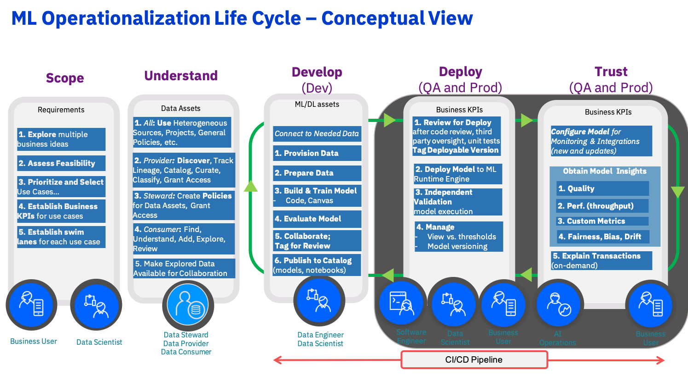
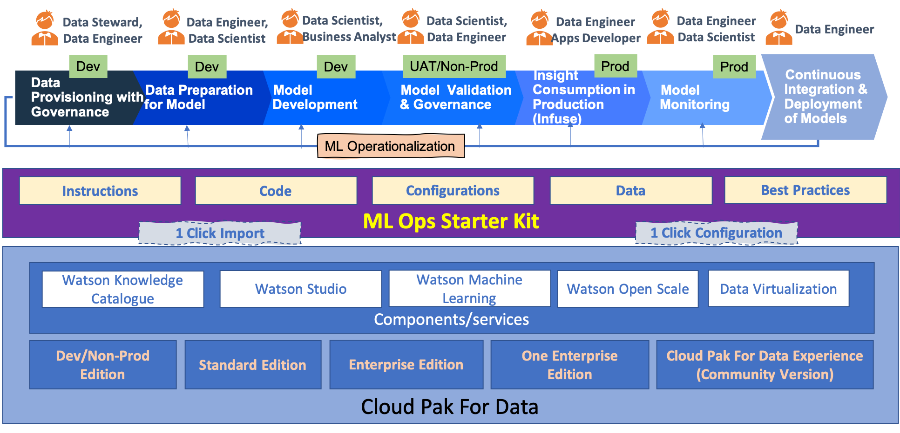
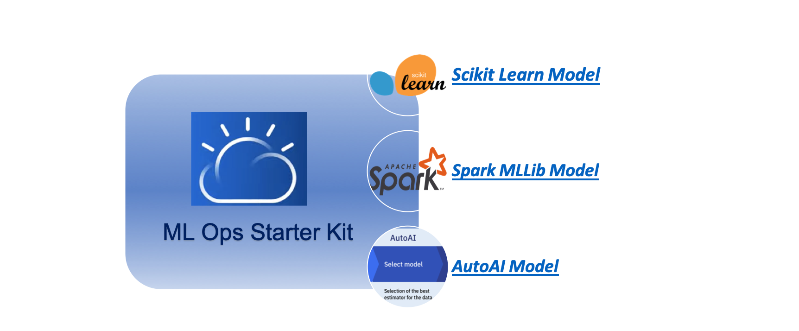

# ML Operationalization Starter Kit for ML Operationalization

### Contents

1. [ML Operationalizarion](#ml-ops-intro)
2. [ML Ops Starter Kit](#ml-ops-starter-kit)
3. [ML Ops Starter Kit Projects](#ml-ops-sk-projects)
4. [Where to use ML Ops Starter Kit Projects](#ml-ops-sk-projects-usage)
5. [ML Ops Starter Kit Roadmap](#ml-ops-sk-roadmap)
6. [Contents of the Repository](#ml-ops-repo-contents)
7. [How to get Started with this Starter Kit](#ml-ops-get-started)

### ML Operationalization<a class="anchor" id="ml-ops-intro">
    
ML Operationalization refers to operationalization of Machine Learning Models for production use and realizing business value out of those Models. 

ML Operationalization covers standard ML Lifecycle (CRISP-DM) overlayed with Continuous Integration/Nontinuous Development paradigm. It covers Data Priovisioning & Governance, Data Preparation for Model Development, Model Development, Model Validation & Governance, Infusing Model's Insight in Application and Model Monitoring overlayed with Continuous Integration/Nontinuous Development paradigm.

For more infornation on conceptual view of ML Operationalization please check [Operationalizing AI](https://ibm.co/AI-Ops)

### ML Ops Starter Kit<a class="anchor" id="ml-ops-starter-kit">

**ML Ops Starter Kit** is an End 2 End framework to help one get started with ML Operationalization. It right now uses components of Cloud Pak For Data. However, can be customised for any other Open Source of Propreitory Infrastructure too.

### ML Ops Starter Kit Projects<a class="anchor" id="ml-ops-sk-projects">

ML Ops Start Kit contains a set of Get Started Projects. Each Project has Instructions, Code/Notebooks, and Data packaged together in a single asset (.zip file) that can be imported as new 'Project' in Cloud Pak For Data project in a single click.

Each Get Started project supports a specific Machine Learning framework. Right now there are 3 Get Started projects supporting
    + Scikit Learn, 
    + Spark MLLib 
    + AutoAI
    + More frameworks; R, Tensore Flow/Keras, SPSS Modeler, etc; are coming soon.

### Where to use ML Ops Starter Kit Projects<a class="anchor" id="ml-ops-sk-projects-usage">

+ As a Starter Creating End to End Demo aligned with ML Ops challenges/requirements of new/prospective clients of CPD
+ Enablement
+ Development of industry specific demos/ assets using Cloud Pak for Data

ML Ops Starter Kit works on any Cloud Pak For Data cluster (that has necessary components) including [Cloud Pak For Data Experience](https://www.ibm.com/cloud/paks/experiences/cloud-pak-for-data) 

ML Ops Starter Kit can be used for othet environments too in Public Cloud, Private Cloud or Hybrid Environment

### ML Ops Starter Kit Roadmap<a class="anchor" id="ml-ops-sk-roadmap">

*Roadmap of ML Ops Starter Kit -*

+ **Wave 1 (on CPD 2.5)**  
    + ML Ops covering Data Preparation, Model Development, Model Deployment & Consumption, and  Model Monitoring
    + Using 3 Machine Learning Model development Frameworks – AutoAI, Scikit Learn and SparkMlLib
    + Covers following components of Cloud Pak for Data - Data Connections, Watson Studio (Data Refinery, Notebooks, Auto AI, Spark/Analytics Engine), Watson Machine Learning and Watson Open Scale

+ **Wave 2 (on CPD 2.5)**  
    + ML Ops including Data Provisioning and Governance using Watson Knowledge Catalog
    + Basic CI/CD using CAM API and Notebook based Jobs

+ **Wave 3 (on CPD 3.0)**  
    + End to End ML Ops covering including Model Validation using Watson Open Scale and Virtualized Data Provisioning using             Data Virtualization
    + Advanced CI/CD using Jenkins and Github (using CLI)
    + Configuring Open Scale using API
    + Additional ML Frameworks – R, Tensor Flow/Keras, Others

### Contents of the Repository<a class="anchor" id="ml-ops-repo-contents">

+ A set of Get Started Projects which can be imported to Cloud Pak For Data for End to End ML Operationalization. 
+ Supporting Assets
    + Best Practices and Guidelines
    + CPD Sizing Guidelines
    + Short Video on ML Ops using Cloud Pak For Data
    + Video on Detailed steps of ML Ops process using Cloud Pak For Data
    + Reference Architecture

### How to get Started with this Starter Kit<a class="anchor" id="ml-ops-get-started">
    
+ If you have some environment of Cloud Pak For Data start with that. Or get your access to free edition of [Cloud Pak For Data](https://www.ibm.com/cloud/paks/experiences/cloud-pak-for-data) cluster
+ Go to Projects folder of this Repository. Select the Project you want to use. Start with the project with Auto AI as that can help you establish an end to end flow in few Hrs. *Right now we have 1 project using Auto AI. We are adding more projects soon.*
+ Go to Supporting Assets folder of this Repository. There you would get other relevant documentations needed by you for ML Ops

