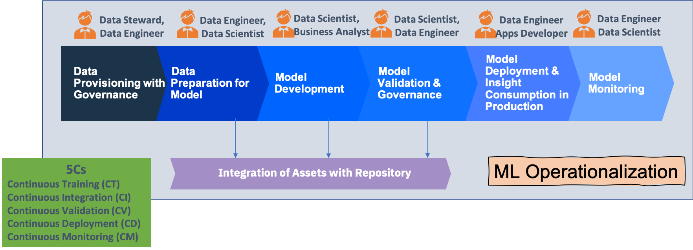
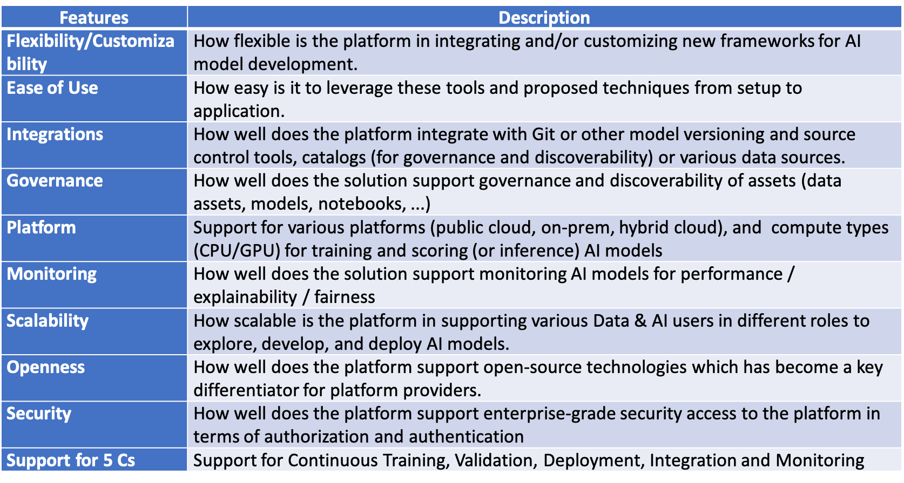
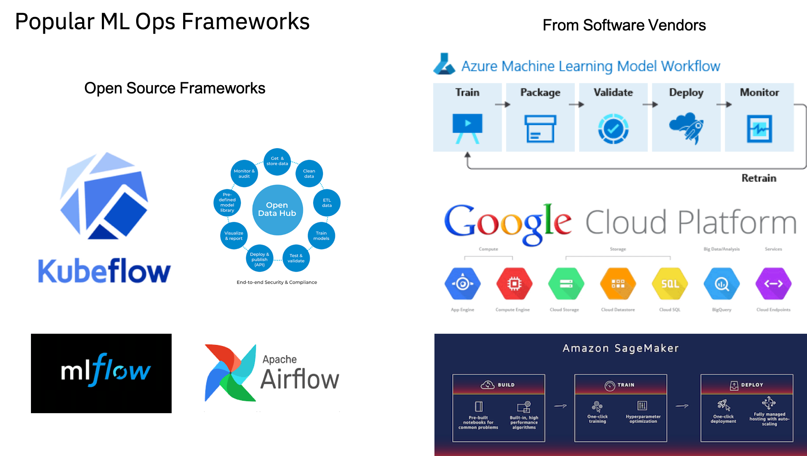
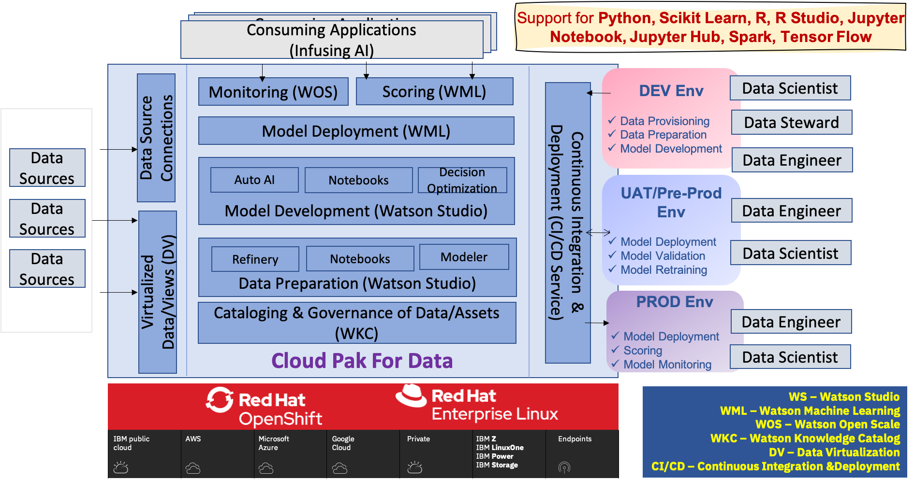
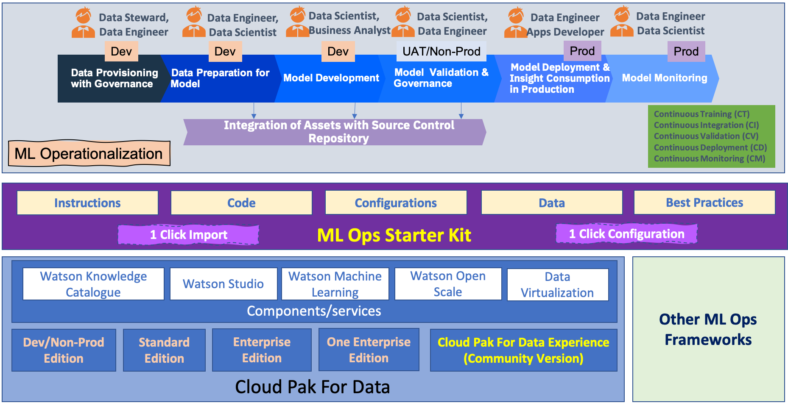

# ML Operationalization Starter Kit for ML Operationalization

### Contents

1. [ML Operationalizarion](#ml-ops-intro)
2. [Frameworks for Operationalizing Models](#ml-ops-cpd-intro)
3. [ML Ops Starter Kit](#ml-ops-starter-kit)
4. [ML Ops Starter Kit Projects](#ml-ops-sk-projects)
5. [Where to use ML Ops Starter Kit Projects](#ml-ops-sk-projects-usage)
6. [ML Ops Starter Kit Roadmap](#ml-ops-sk-roadmap)
7. [Contents of the Repository](#ml-ops-repo-contents)
8. [How to get Started with this Starter Kit](#ml-ops-get-started)
9. [Contributors](#ml-ops-contributors)

### ML Operationalization<a class="anchor" id="ml-ops-intro">
    
ML Operationalization refers to operationalization of Machine Learning Models for production use to realize business value out of those Models. 

ML Operationalization covers standard ML Lifecycle (CRISP-DM) overlaid with Continuous Integration/Continuous Development paradigm. It covers Data Priovisioning & Governance, Data Preparation for Model Development, Model Development, Model Validation & Governance, Infusing Model's Insight in Application and Model Monitoring in a continuous fashion.

In contrast to Appplication DevOps, MLOps not only takes care of Continuous Integration and Continuous Deployment but also covers Continuous Training, Continuous Validation and Continuous Monitoring.

The diagram below show the ML Ops steps and persona

For more infornation on conceptual view of ML Operationalization please check [Operationalizing AI](https://ibm.co/AI-Ops)

### Key Capabilitied needed for Operationalizing Models<a class="anchor" id="ml-ops-cpd-intro">

Here are the key Functional Capabilities those are needed in establishing ML Operationalization in an organization.

Along with these functional capabilities having right set of Non Functional Capabilities is important too

### Frameworks for Operationalizing Models<a class="anchor" id="ml-ops-cpd-intro">
    

There are various frameworks and platforms available for ML Operationalization with varied degree of support for required Functional and Non Functional capabilities

**IBM Cloud Pak For Data** is a platform that supports required Functional and Non Functional Capabilities required by ML Operationalization in a comprehensive way. It is a platform to accelerate realization of business value from Machine Learning Models with an open, extensible data and AI platform that runs on any cloud.

For detailed information about Cloud Pak For Data please check [here](https://www.ibm.com/products/cloud-pak-for-data)

### ML Ops Starter Kit<a class="anchor" id="ml-ops-starter-kit">

**ML Ops Starter Kit** is an End 2 End framework to help one get started with ML Operationalization. It ruses components of Cloud Pak For Data. However, can be extended for any other Open Source of Propreitory ML Ops frameworks too for supporting any kind of hybrid approach.

### ML Ops Starter Kit Projects<a class="anchor" id="ml-ops-sk-projects">

ML Ops Start Kit contains a set of Get Started Projects. Each Project has Instructions, Code/Notebooks, and Data packaged together in a single asset (.zip file) that can be imported as new 'Project' in Cloud Pak For Data project in a single click.

ML Ops Start Kit uses Customer Churn Use case for a communications company. The use case covers key aspects of operationalizing a customer churn model like

    + Merging usage data with demographic data

    + Automatically selecting algorithms

    + Adding mathematical features if needed

    + Monitoring the model for bias around age or gender

    + Checking the model's explanations on the key factors that might create customer churn, such as income or dropped calls

Each Get Started project supports a specific Machine Learning framework. Right now there are 3 Get Started projects supporting
    + Scikit Learn, 
    + Spark MLLib 
    + AutoAI
    + More frameworks; R, Tensore Flow/Keras, SPSS Modeler, etc; are coming soon.

### Where to use ML Ops Starter Kit Projects<a class="anchor" id="ml-ops-sk-projects-usage">

+ Creating End to End Demo aligned with ML Ops challenges/requirements for a use case
+ Enablement
+ Development of industry specific demos/ assets using Cloud Pak for Data

ML Ops Starter Kit works on any Cloud Pak For Data cluster (that has necessary components) including [Cloud Pak For Data Experience](https://www.ibm.com/cloud/paks/experiences/cloud-pak-for-data). 

ML Ops Starter Kit can be potentially extended to other ML Ops frameworks in Public Cloud, Private Cloud or Hybrid Environment

### ML Ops Starter Kit Roadmap<a class="anchor" id="ml-ops-sk-roadmap">

*Intended Roadmap of ML Ops Starter Kit. Can be changed based on priorities -*

+ **Wave 1 (on CPD 2.5)**  
    + ML Ops covering Data Preparation, Model Development, Model Deployment & Consumption, and  Model Monitoring
    + Using 3 Machine Learning Model development Frameworks – AutoAI, Scikit Learn and SparkMlLib
    + Covers following components of Cloud Pak for Data - Data Connections, Watson Studio (Data Refinery, Notebooks, Auto AI, Spark/Analytics Engine), Watson Machine Learning and Watson Open Scale

+ **Wave 2 (on CPD 3.0)**  
    + End to End ML Ops covering including Model Validation using Watson Open Scale
    + ML Ops including Data Provisioning and Governance using Watson Knowledge Catalog

+ **Wave 3 (on CPD 3.0)**  
    + ML Ops including Data Provisioning and Governance using Watson Knowledge Catalog 
    + Virtualized Data Provisioning using Data Virtualization
    + Advanced CI/CD using Jenkins and Github
    + Configuring Open Scale using API
    + Additional ML Frameworks – R, Tensor Flow/Keras, Others
    + Other potential ML Operationalization Frameworks (Open Source)

### Contents of the Repository<a class="anchor" id="ml-ops-repo-contents">

+ A set of Get Started Projects which can be imported to Cloud Pak For Data for End to End ML Operationalization. 
+ Supporting Assets
    + Best Practices and Guidelines
    + Short Video on ML Ops using Cloud Pak For Data
    + Video on Detailed steps of ML Ops process using Cloud Pak For Data
    + Reference Architecture

### How to get Started with this Starter Kit<a class="anchor" id="ml-ops-get-started">
    
+ If you have some environment of Cloud Pak For Data start with that. Or get your access to free edition of [Cloud Pak For Data Experience](https://www.ibm.com/cloud/paks/experiences/cloud-pak-for-data) cluster
+ Go to Projects folder of this Repository. Select the Project you want to use. Start with the project with Auto AI as that can help you establish an end to end flow in few Hrs. *Right now we have 1 project using Auto AI. We are adding more projects soon.*
+ Go to Supporting Assets folder of this Repository. There you would get other relevant documentations that may beneeded by you for ML Ops

### Contributors<a class="anchor" id="ml-ops-contributors">
    
+ [Shikhar Kwatra](https://www.linkedin.com/in/shikharkwatra/)
+ [Mak Kader](https://www.linkedin.com/in/makkader/)
+ [Stacey Ronaghan](https://www.linkedin.com/in/staceyronaghan/)
+ [Rakshith DasenahalliLingaraju](https://www.linkedin.com/in/rakshith-dasenahallilingaraju-600639100/)
+ [Sourav Mazumder](https://www.linkedin.com/in/souravmazumder/)
+ [Sunil Dube](https://www.linkedin.com/in/sunil-dube-b861861/)

Please [contact me](mailto:smazumder@us.ibm.com) for any questions.
